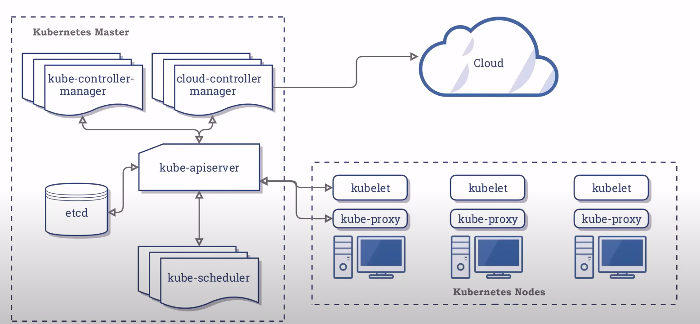
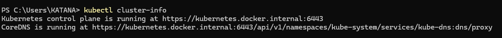
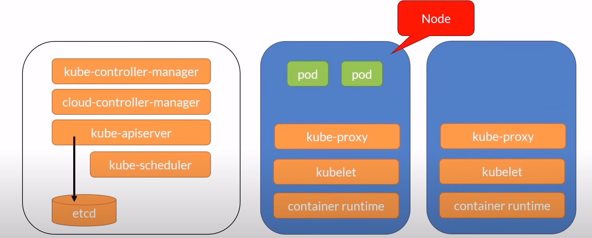
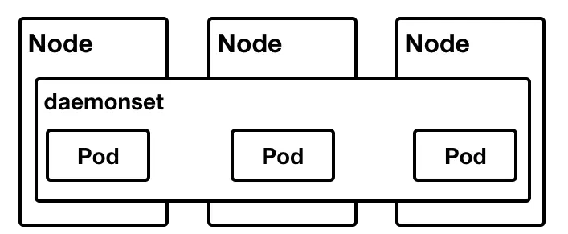

# 23/6/2025

--------------------------------------------------
# K8s
# K8s Architecture


# Kubernetes local

Let’s test our local Kubernetes installation.

    kubectl cluster-info
    Câu lệnh kubectl cluster-info dùng để hiển thị thông tin về các endpoint (điểm truy cập) của cluster Kubernetes mà bạn đang kết nối.

      Cụ thể:
      - Nó cho bạn biết địa chỉ API server và các dịch vụ quan trọng như dashboard, DNS, v.v.
      - Giúp xác nhận bạn đã kết nối đúng cluster và cluster đang hoạt động.
   

# K8s CLI & Context (L18-02 Using Kubectl)

    Kubernetes context là một khái niệm trong kubeconfig dùng để xác định môi trường mà bạn sẽ thao tác khi sử dụng kubectl. Một context bao gồm:

    Cluster: Cụm Kubernetes bạn muốn kết nối.
    User: Thông tin xác thực (user/token/certificate) để truy cập cluster.
    Namespace: Namespace mặc định khi chạy lệnh. 

    Tác dụng:
    Context giúp bạn dễ dàng chuyển đổi giữa nhiều cluster, user, hoặc namespace mà không cần thay đổi thủ công từng thông tin.

## Current context

Get the current context:

      kubectl config current-context


## List all contexts

List all the contexts:

    kubectl config get-contexts

## Change context

Use a context:

    kubectl config use-context [contextName]


## Using kubectx

What's great about Kubernetes is the incredible amount of tools created by the community and available for free.  Kubectx is a simple tool that provides an easy way to list and change context.

You can install it on:

Windows (if you have Chocolatey installed):

    choco install kubectx-ps

macOS (if you have Brew installed):

    brew install kubectx

Ubuntu:

    sudo apt install kubectx

To list the contexts, simply type:

    kubectx

To change context:

    kubectx <contextName>

## Rename context

Rename context:

    kubectl config rename-context [old-name] [new-name]

## Delete context

Delete context:

    kubectl config delete-context [contextName]

## The declarative way vs the imperative way (L18-04 Declarative vs Imperative)

Trong Kubernetes (và DevOps nói chung), declarative và imperative là hai cách tiếp cận để quản lý tài nguyên:
1. Imperative Way (Cách tiếp cận mệnh lệnh)
- Bạn ra lệnh trực tiếp cho hệ thống thực hiện một hành động cụ thể.
- Mỗi lệnh là một hành động riêng lẻ, ví dụ như tạo, cập nhật, hoặc xóa tài nguyên.
- **Ví dụ**
```
kubectl create deployment nginx --image=nginx
kubectl delete pod mypod
kubectl scale deployment nginx --replicas=3
```
- Ưu điểm: Nhanh, dễ dùng cho thao tác nhỏ, thử nghiệm.
- Nhược điểm: Khó kiểm soát trạng thái tổng thể, khó lặp lại hoặc tự động hóa.
2. Declarative Way (Cách tiếp cận khai báo)
- Bạn mô tả trạng thái mong muốn của hệ thống bằng file cấu hình (YAML/JSON).
- Kubernetes sẽ tự động điều chỉnh để đạt được trạng thái đó.
- **Ví dụ**: Tạo file deployment.yaml:

````
apiVersion: apps/v1
kind: Deployment
metadata:
  name: nginx
spec:
  replicas: 3
  template:
    metadata:
      labels:
        app: nginx
    spec:
      containers:
      - name: nginx
        image: nginx
````
- Sau đó áp dụng:
````
kubectl apply -f deployment.yaml
````
**Cấu trúc file lên trang chủ k8s lấy**

Let's deploy an Nginx container using both methods.

## Imperative

    kubectl create deployment mynginx1 --image=nginx

## Declarative

    kubectl create -f deploy-example.yaml

## Cleanup

    kubectl delete deployment mynginx1
    kubectl delete deploy mynginx2

# Namesapces (L19-02 Namespaces)
Namespaces trong Kubernetes (K8s) là một cách để phân chia tài nguyên trong một cluster thành các không gian logic riêng biệt. Mỗi namespace là một “vùng” độc lập, giúp bạn:
- **Tách biệt môi trường**: Ví dụ: dev, test, prod có thể là các namespace khác nhau.
- **Quản lý tài nguyên**: Giới hạn tài nguyên (CPU, RAM) cho từng namespace.
- **Phân quyền truy cập**: Gán quyền cho user hoặc service account theo namespace.

### Mặc định K8s có các namespace:

- ``default``: Namespace mặc định cho các tài nguyên không chỉ định namespace.
- ``kube-system``: Chứa các tài nguyên hệ thống của Kubernetes.
- ``kube-public``: Một số tài nguyên public, ai cũng truy cập được.
- ``kube-node-lease``: Quản lý thông tin heartbeat của node.
## Get namespaces

Open a terminal and get the currently configured namespaces.

    kubectl get namespaces
    kubectl get ns

## Get the pods list

Get a list of all the installed pods.

    kubectl get pods

You get the pods from the default namespace.  Try getting the pods from the docker namespace.  You will get a different list.

    kubectl get pods --namespace=kube-system
    kubectl get pods -n kube-system

## Change namespace

Change the namespace to the docker one and get the pods list.

    kubectl config set-context --current --namespace=kube-system

## Get the pods

    kubectl get pods

## Now change back to the default namespace

    kubectl config set-context --current --namespace=default
    kubectl get pods

## Create and delete a namespace

    kubectl create ns [name]
    kubectl get ns
    kubectl delete ns [name]

# Nodes (L20-03 Nodes)
Nodes trong Kubernetes (K8s) là các máy chủ vật lý hoặc máy ảo trong cluster, nơi các Pod được chạy và quản lý. Mỗi node cung cấp tài nguyên tính toán như CPU, RAM, ổ đĩa và mạng cho các ứng dụng container.
Có 2 loại node chính:
- **Master node (Control Plane)**: Quản lý và điều phối toàn bộ cluster (chạy các thành phần như kube-apiserver, kube-controller-manager, kube-scheduler, v.v.).
- **Worker node**: Nơi thực tế các Pod/ứng dụng được triển khai và chạy. Mỗi worker node chạy các thành phần như kubelet, kube-proxy và container runtime (Docker, containerd...).




## Get nodes information

Get a list of all the installed nodes. Using Docker Desktop, there should be only one.

    kubectl get nodes

Get some info about the node.

    kubectl describe node

# Pods (L21-04 Pods)
**Pod** trong Kubernetes (K8s) là đơn vị triển khai nhỏ nhất và cơ bản nhất. Một Pod đại diện cho một hoặc nhiều container (thường là một) được chạy cùng nhau trên một node, chia sẻ cùng network, storage và cấu hình.

Đặc điểm của Pod:

- Chứa một hoặc nhiều container: Các container trong cùng một Pod có thể giao tiếp với nhau qua localhost.
- Chia sẻ network: Các container trong Pod dùng chung IP, port, và network namespace.
- Chia sẻ storage: Có thể gắn volume dùng chung giữa các container trong Pod.
- Vòng đời ngắn: Pod không được thiết kế để tồn tại lâu dài; khi Pod bị xóa, không thể khôi phục lại chính nó (thường dùng Deployment để quản lý vòng đời Pod).

### Pods lifecycle
Vòng đời (lifecycle) của một Pod trong Kubernetes gồm các trạng thái chính sau:

1. Pending
Pod đã được tạo nhưng chưa có container nào chạy.
Thường do scheduler đang tìm node phù hợp hoặc đang pull image.
2. Running
Pod đã được gán vào một node và ít nhất một container đang chạy.
3. Succeeded
Tất cả container trong Pod đã chạy xong và thoát thành công (exit code 0).
Thường gặp với Pod chạy job ngắn hạn.
4. Failed
Tất cả container trong Pod đã kết thúc, nhưng ít nhất một container bị lỗi (exit code khác 0).
5. Unknown
Trạng thái Pod không xác định được (thường do lỗi kết nối với node).

Let’s first create a node running Nginx by using the imperative way.

## Create the pod

    kubectl run mynginx --image=nginx

## Get a list of running pods

    kubectl get pods

## Get more info

    kubectl get pods -o wide
    kubectl describe pod mynginx

## Delete the pod

    kubectl delete pod mynginx

## Create a pod running BusyBox

Let’s now create a node running BusyBox, this time attaching bash to our terminal.

    kubectl run mybox --image=busybox -it -- /bin/sh

## List the folders and use command

    ls
    echo -n 'A Secret' | base64
    exit

## Cleanup

    kubectl delete pod mybox

## Create a pod using the declarative way

Let’s now create a node using a YAML file.

    kubectl create -f myapp.yaml

## Get some info

    kubectl get pods -o wide
    kubectl describe pod myapp-pod

## Attach our terminal

    kubectl exec -it myapp-pod -- bash

Print the DBCON environment variable that was set in the YAML file.

    echo $DBCON

## Detach from the instance

    exit

## Cleanup

    kubectl delete -f myapp.yaml

# Init Container (L21-05 Init Containers)
Init Container trong Kubernetes là một loại container đặc biệt, chạy trước các container chính (app containers) trong một Pod.

Đặc điểm của Init Container:
- **Chạy tuần tự**: Mỗi Init Container phải hoàn thành xong thì container tiếp theo (hoặc container chính) mới được chạy.
- **Dùng cho các tác vụ khởi tạo**: Ví dụ: tải file cấu hình, kiểm tra kết nối, chuẩn bị dữ liệu, hoặc chờ một dịch vụ khác sẵn sàng.
- **Tách biệt với container chính**: Có thể dùng image, command, môi trường khác với container chính.

Let's use an Init container.

## Create the deployment

    kubectl apply -f myapp.yaml

Wait for the main pod to come up

    kubectl get pods

## Connect to the Nginx container

    kubectl exec -it init-demo -- /bin/bash

## Hit the default webpage

It should be the one downloaded by the Init container from http://info.cern.ch

    curl localhost
    exit

## Cleanup

    kubectl delete -f myapp.yaml

# Selector (L22-02 Selectors)
Selector trong Kubernetes (K8s) là cơ chế để lựa chọn và lọc các đối tượng (resources) dựa trên nhãn (label) hoặc annotation. Selector thường được dùng để xác định nhóm Pod mà một resource khác (như Service, ReplicaSet, Deployment) sẽ quản lý hoặc tương tác.

Có 2 loại selector chính:
1. Label Selector:

        Dựa trên key-value của label.
        Phổ biến nhất, dùng trong hầu hết các

3. Field Selector:

        Dựa trên giá trị của trường (field) trong resource (ví dụ: status, metadata.name).


## Deploy the app

    kubectl apply -f myapp.yaml

## Deploy the service

    kubectl apply -f myservice.yaml

## Is the service connected to the pod?

If so, the enpoint will point to the pod IP address.  Get the IP address of the pod:

    kubectl get po -o wide

Then get the service endpoint.  The IP address should match.

    kubectl get ep myservice

## Port forward to the service

    kubectl port-forward service/myservice 8080:80

Open a browser and point to http://localhost:8080

Stop the port forward by typing **Ctrl-C**

## Edit the app YAML file

Change the **app** label to myapp2 and save the file

Deploy the change

    kubectl apply -f myapp.yaml

## Check the endpoint again

    kubectl get ep myservice

## Port forward to the service again

    kubectl port-forward service/myservice 8080:80

Open a browser and point to http://localhost:8080

Stop the port forward by typing **Ctrl-C**

## Cleanup

    kubectl delete -f myservice.yaml
    kubectl delete -f myapp.yaml

# Multi-container Pods (L23-03 Multi Containers Pods)

Let’s create multiple containers in a Pod using a YAML file.  We'll use the Busybox container to get the default page served by the Nginx container.

## Create the pod

    kubectl create -f two-containers.yaml

## Get some info

    kubectl get pods -o wide
    kubectl describe pod two-containers

## Connect to the BusyBox container

    kubectl exec -it two-containers --container mybox -- /bin/sh

## Fetch the HTML page served by the Nginx container

This will output the content of the Web page in the terminal.

    wget -qO- localhost

## Quit

    exit

## Cleanup

    kubectl delete -f two-containers.yaml --force --grace-period=0

# Workloads
**Workloads** trong Kubernetes (K8s) là các đối tượng (resources) dùng để triển khai và quản lý các ứng dụng chạy trên cluster. Workloads giúp bạn kiểm soát vòng đời, số lượng, cập nhật, và khả năng mở rộng của các ứng dụng container.

Các loại Workloads phổ biến trong K8s:
- **Pod**: Đơn vị triển khai nhỏ nhất, chứa một hoặc nhiều container.
- **ReplicaSet**: Đảm bảo số lượng Pod luôn đúng như mong muốn.
- **Deployment**: Quản lý ReplicaSet và Pod, hỗ trợ cập nhật (rolling update), rollback.
- **StatefulSet**: Quản lý các ứng dụng cần trạng thái cố định (ví dụ: database), mỗi Pod có danh tính riêng.
- **DaemonSet**: Đảm bảo mỗi node đều chạy một bản sao của Pod (thường dùng cho các tác vụ hệ thống như log, monitoring).
- **Job**: Chạy một hoặc nhiều Pod cho đến khi hoàn thành một tác vụ rồi tự kết thúc.
**CronJob**: Tự động chạy Job theo lịch định kỳ (giống cron trên Linux).

# ReplicaSets
**ReplicaSet** trong Kubernetes (K8s) là một resource dùng để đảm bảo số lượng Pod chạy cùng lúc luôn đúng như mong muốn (desired state).

Đặc điểm của ReplicaSet:
- **Tự động tạo hoặc xóa Pod** để duy trì số lượng Pod đúng như khai báo.
- **Sử dụng selector** (thường là label selector) để xác định nhóm Pod mà ReplicaSet quản lý.
- Nếu một Pod bị lỗi hoặc bị xóa, ReplicaSet sẽ tự động tạo Pod mới thay thế.
Let's now use the ReplicaSet template instead of the Pod template.
```yaml
apiVersion: apps/v1
kind: ReplicaSet
metadata:
 name: rs-example
spec:
 replicas: 3
 selector:
   matchLabels:
     app: nginx
     type: front-end
 template: 
   metadata:
     labels:
       app: nginx
       type: front-end
   spec:
     containers:
     - name: nginx
       image: nginx:alpine
       resources:
         requests:
           cpu: 100m
           memory: 128Mi
         limits:
           cpu: 250m
           memory: 256Mi 
       ports:
       - containerPort: 80
```

## Create the ReplicaSet

    kubectl apply -f rs-example.yaml

## Get the pods list

    kubectl get pods -o wide

## Get the ReplicaSet name

    kubectl get rs

## Describe the ReplicaSet

    kubectl describe rs rs-example

## Cleanup

    kubectl delete -f rs-example.yaml

# Deployment
**Deployment** trong Kubernetes (K8s) là một resource dùng để quản lý việc triển khai, cập nhật và mở rộng các Pod thông qua ReplicaSet một cách tự động và nhất quán.
Đặc điểm của Deployment:
- **Tự động tạo và quản lý ReplicaSet** để đảm bảo số lượng Pod luôn đúng như mong muốn.
- **Hỗ trợ cập nhật rolling update**: Khi thay đổi cấu hình (ví dụ: image mới), Deployment sẽ cập nhật dần dần các Pod mà không làm gián đoạn dịch vụ.
- **Rollback**: Có thể quay lại phiên bản trước nếu cập nhật gặp lỗi.
- **Tự động khôi phục**: Nếu Pod bị lỗi hoặc bị xóa, Deployment sẽ tự động tạo lại Pod mới.
```yaml
apiVersion: apps/v1
kind: Deployment
metadata:
  name: deploy-example
spec:
  replicas: 3
  revisionHistoryLimit: 3
  selector:
    matchLabels:
      app: nginx
      env: prod
  template:
    metadata:
      labels:
        app: nginx
        env: prod
    spec:
      containers:
      - name: nginx
        image: nginx:alpine
        resources:
          requests:
            cpu: 100m
            memory: 128Mi
          limits:
            cpu: 250m
            memory: 256Mi        
        ports:
        - containerPort: 80

```
Let's now use the Deployment template instead of the Pod template.

## Create the Deployment

    kubectl apply -f deploy-example.yaml

## Get the pods list

    kubectl get pods -o wide
    
## Describe the pod

    kubectl describe pod deploy-example

## Get the Deployment info

    kubectl get deploy
    kubectl describe deploy deploy-example

## Get the ReplicaSet name

    kubectl get rs

## Describe the ReplicaSet

    kubectl describe rs

## Cleanup

    kubectl delete -f deploy-example.yaml

# DaemonSet
**DaemonSet** là một loại resource trong Kubernetes dùng để đảm bảo rằng mỗi node trong cluster đều chạy một bản sao của một Pod cụ thể.
**Đặc điểm của DaemonSet:**
- Triển khai Pod trên tất cả các node: Mỗi node sẽ có một Pod chạy, kể cả khi thêm node mới vào cluster.
- Tự động thêm/xóa Pod: Khi node được thêm vào hoặc xóa khỏi cluster, DaemonSet sẽ tự động tạo hoặc xóa Pod tương ứng trên node đó.
- Thường dùng cho các tác vụ hệ thống: Ví dụ: thu thập log (Fluentd, Logstash), monitoring (Prometheus Node Exporter), quản lý mạng (CNI plugin), v.v.

```yaml
apiVersion: apps/v1
kind: DaemonSet
metadata:
  name: daemonset-example
  labels:
    app: daemonset-example
spec:
  selector:
    matchLabels:
      app: daemonset-example
  template:
    metadata:
      labels:
        app: daemonset-example
    spec:
      tolerations:
      - key: node-role.kubernetes.io/master
        effect: NoSchedule
      containers:
      - name: busybox
        image: busybox
        args:
        - sleep
        - "10000"
```
Let's deploy a Busybox as a DaemonSet.

## Create the Deployment

    kubectl apply -f daemonset.yaml

## Get the pods list

There should be one for each worker node.

    kubectl get pods --selector=app=daemonset-example -o wide

## Cleanup

    kubectl delete -f daemonset.yaml

# StatefulSet
**StatefulSet** trong Kubernetes (K8s) là một resource dùng để triển khai và quản lý các ứng dụng cần trạng thái (stateful), nơi mỗi Pod có danh tính (identity) riêng, ổn định và lưu trữ dữ liệu bền vững.
Đặc điểm của StatefulSet:
- Mỗi Pod có tên duy nhất: Ví dụ: web-0, web-1, web-2...
- Thứ tự khởi tạo và xóa: Pod được tạo/xóa theo thứ tự (từ nhỏ đến lớn hoặc ngược lại).
- Lưu trữ ổn định: Thường kết hợp với PersistentVolume, mỗi Pod gắn với một volume riêng biệt, dữ liệu không bị mất khi Pod bị xóa hoặc restart.
- Dùng cho ứng dụng cần state: Database (MySQL, MongoDB, Cassandra...), hệ thống queue, v.v.
```yaml
apiVersion: v1
kind: Service
metadata:
  name: nginx-headless
  labels:
    run: nginx-sts-demo
spec:
  ports:
  - port: 80
    name: web
  clusterIP: None
  selector:
    run: nginx-sts-demo
---
apiVersion: apps/v1
kind: StatefulSet
metadata:
  name: nginx-sts
spec:
  serviceName: nginx-headless
  replicas: 3
  selector:
    matchLabels:
      run: nginx-sts-demo
  template:
    metadata:
      labels:
        run: nginx-sts-demo
    spec:
      containers:
      - name: nginx
        image: nginx
        volumeMounts:
        - name: www
          mountPath: /var/www/
  volumeClaimTemplates:
  - metadata:
      name: www
    spec:
      storageClassName: hostpath
      accessModes:
        - ReadWriteOnce
      resources:
        requests:
          storage: 10Mi
```
Let's now create a StafulSet.

## Create the Deployment

    kubectl apply -f statefulset.yaml

## Get the pods list

    kubectl get pods -o wide

## Get a list of the PersistentVolumes Claims

    kubectl get pvc

## Create a file in nginx-sts-2

Open a session in nginx-sts-2 and create a file in the folder mapped to the volume.

    kubectl exec nginx-sts-2 -it -- /bin/sh
    cd var/www
    echo Hello > hello.txt

## Modify the default Web page

    cd /usr/share/nginx/html
    cat > index.html
    Hello
    Ctrl-D
    exit

## Open a session in nginx-sts-0 and reach nginx-sts-2

    kubectl exec nginx-sts-0 -it -- /bin/sh
    curl http://nginx-sts-2.nginx-headless
    exit

## Delete pod 2

Delete a pod and watch as it is recreated with the same name.

    kubectl delete pod nginx-sts-2

## Is the file still there?

Open a session in nginx-sts-2 and see if the file is still present.

    kubectl exec nginx-sts-2 -it -- /bin/sh
    ls var/www
    exit

## Cleanup

    kubectl delete -f statefulset.yaml
    kubectl delete pvc www-nginx-sts-0
    kubectl delete pvc www-nginx-sts-1
    kubectl delete pvc www-nginx-sts-2

# Job
**Job** trong Kubernetes (K8s) là một resource dùng để chạy một hoặc nhiều Pod cho đến khi hoàn thành một tác vụ cụ thể, sau đó tự động kết thúc.
Đặc điểm của Job:
- Đảm bảo một tác vụ (task) được thực thi thành công một hoặc nhiều lần.
- Khi Pod chạy xong (exit code 0), Job sẽ kết thúc.
- Nếu Pod bị lỗi, Job sẽ tự động tạo lại Pod mới cho đến khi task hoàn thành hoặc đạt số lần retry tối đa.
- Thường dùng cho các tác vụ batch, xử lý dữ liệu, migrate database, gửi email, v.v.
```yaml
apiVersion: batch/v1
kind: Job
metadata:
  name: hello
spec:
  template:
    spec:
      containers:
      - name: busybox
        image: busybox
        command: ["echo", "Hello from the Job"]
      restartPolicy: Never
```
Let's now use the Job template.

## Create the Job

    kubectl apply -f job.yaml

## Get the jobs list

    kubectl get jobs

## Get more info

    kubectl describe job

## Get the pod name

Get the pod's log.  Something starting with **hello-**

    kubectl get pods

## Get the jobs list

Get the container's log.  You should see **Hello from the Job**.

    kubectl logs <podName>

## Cleanup

    kubectl delete -f job.yaml

# CronJob
CronJob trong Kubernetes (K8s) là một resource dùng để chạy các Job theo lịch định kỳ, giống như cron trên Linux.
Đặc điểm của CronJob:
- Tự động tạo Job mới theo lịch bạn định nghĩa (ví dụ: mỗi phút, mỗi giờ, mỗi ngày...).
- Mỗi lần chạy sẽ tạo một Job riêng biệt.
Thường dùng cho các tác vụ định kỳ như backup, gửi báo cáo, dọn dẹp dữ liệu, v.v.
```yaml
apiVersion: batch/v1
kind: CronJob
metadata:
  name: hello-cron
spec:
  schedule: "* * * * *"
  jobTemplate:
    spec:
      template:
        spec:
          containers:
          - name: busybox
            image: busybox
            command: ["echo", "Hello from the CronJob"]
          restartPolicy: Never
```
Let's now use the CronJob template.

## Create the Job

    kubectl apply -f cronjob.yaml

## Get the jobs list

    kubectl get cronjobs

## Get more info

    kubectl describe cronjob

## Get the pod name

Get the pod's log.  Something starting with **hello-**

    kubectl get pods

## Get the jobs list

Get the container's log.  You should see **Hello from the Job**.

    kubectl logs <podName>

## Cleanup

    kubectl delete -f cronjob.yaml

# Rolling Updates
Rolling Updates trong Kubernetes là cơ chế cập nhật ứng dụng mà không làm gián đoạn dịch vụ. Khi bạn cập nhật Deployment (ví dụ: đổi image), Kubernetes sẽ lần lượt tạo Pod mới (phiên bản mới) và xóa Pod cũ (phiên bản cũ) cho đến khi toàn bộ ứng dụng được cập nhật.

Đặc điểm của Rolling Updates:
- Đảm bảo luôn có Pod sẵn sàng phục vụ trong quá trình cập nhật.
- Có thể kiểm soát số lượng Pod mới tạo và Pod cũ bị xóa cùng lúc qua các tham số:
    - maxSurge: Số Pod mới tối đa có thể vượt quá số lượng replicas trong quá trình update.
    - maxUnavailable: Số Pod tối đa có thể không sẵn sàng trong quá trình update.
```yaml
apiVersion: apps/v1
kind: Deployment
metadata:
  name: hello-dep
  namespace: default
spec:
  replicas: 3
  strategy:
    type: RollingUpdate
    rollingUpdate:
      maxSurge: 1
      maxUnavailable: 1
  selector:
    matchLabels:
      app: hello-dep
  template:
    metadata:
      labels:
        app: hello-dep
    spec:
      containers:
      - image: guybarrette/hello-app:1.0
        resources:
          requests:
            cpu: 100m
            memory: 128Mi
          limits:
            cpu: 250m
            memory: 256Mi      
        imagePullPolicy: Always
        name: hello-dep
        ports:
        - containerPort: 8080
```
## Create a V1 Deployment

    kubectl create -f hello-deployment.yaml

## Get the deployment status

    kubectl rollout status deployment/hello-dep

## Get the pods list

    kubectl get pods -o wide

## Describe the pod

    kubectl describe pod hello-dep

## How many ReplicaSets do we have?

    kubectl get rs

Do not delete the Deployment yet!

---

## Create a V2 Deployment

Edit the YAML file and change the container version from 1.0 to 2.0. Save the file.
 
## Create the Deployment

    kubectl apply -f hello-deployment.yaml

## Get the deployment status

    kubectl rollout status deployment/hello-dep

## Get the pods list

    kubectl get pods -o wide

## How many ReplicaSets do we have?

    kubectl get rs

## Get the deployment history

    kubectl rollout status deployment/hello-dep

---
 
## Rollback

## Undo the last deployment using either

    kubectl rollout undo deployment/hello-dep

or

    kubectl rollout undo deployment/hello-dep --to-revision 1

## Get the deployment history

    kubectl rollout status deployment/hello-dep

## How many ReplicaSets do we have?

    kubectl get rs

## Cleanup

    kubectl delete -f hello-deployment.yaml

# Blue-Green Deployments
**Blue-Green Deploymen**t là một chiến lược triển khai ứng dụng giúp giảm thiểu downtime và rủi ro khi cập nhật phiên bản mới.
Cách hoạt động:
- **Blue**: Là phiên bản ứng dụng hiện tại đang chạy (production).
- **Green**: Là phiên bản mới chuẩn bị được triển khai.
- Bạn triển khai phiên bản mới (Green) song song với phiên bản cũ (Blue).
- Khi Green đã sẵn sàng và kiểm tra ổn định, bạn chuyển toàn bộ traffic từ Blue sang Green (thường bằng cách cập nhật Service hoặc load balancer).
Nếu có sự cố, bạn có thể nhanh chóng chuyển lại traffic về Blue.
Ưu điểm:
- Giảm downtime gần như bằng 0.
- Dễ rollback nếu có lỗi.
Ứng dụng trong Kubernetes:
- Tạo 2 Deployment (blue và green) với label khác nhau.
- Dùng Service để trỏ traffic tới Deployment mong muốn bằng cách thay đổi selector.
Tóm lại:
Blue-Green Deployment giúp cập nhật ứng dụng an toàn, nhanh chóng và dễ dàng rollback trong Kubernetes hoặc các hệ thống CI/CD hiện đại.

```yaml
apiVersion: v1
kind: Service
metadata:
 name: svc-front
spec:
  ports:
  - port: 8080
    targetPort: 8080
  selector:
    app: hello-v1
```

```yaml
apiVersion: apps/v1
kind: Deployment
metadata:
  name: hello-v1
spec:
  replicas: 3
  strategy:
    type: RollingUpdate
    rollingUpdate:
      maxSurge: 1
      maxUnavailable: 1
  selector:
    matchLabels:
      app: hello-v1
  template:
    metadata:
      labels:
        app: hello-v1
    spec:
      containers:
      - image: guybarrette/hello-app:1.0
        resources:
          requests:
            cpu: 100m
            memory: 128Mi
          limits:
            cpu: 250m
            memory: 256Mi      
        imagePullPolicy: Always
        name: hello-v1
        ports:
        - containerPort: 8080
```

```yaml
apiVersion: apps/v1
kind: Deployment
metadata:
  name: hello-v2
spec:
  replicas: 3
  strategy:
    type: RollingUpdate
    rollingUpdate:
      maxSurge: 1
      maxUnavailable: 1
  selector:
    matchLabels:
      app: hello-v2
  template:
    metadata:
      labels:
        app: hello-v2
    spec:
      containers:
      - image: guybarrette/hello-app:2.0
        resources:
          requests:
            cpu: 100m
            memory: 128Mi
          limits:
            cpu: 250m
            memory: 256Mi      
        imagePullPolicy: Always
        name: hello-v2
        ports:
        - containerPort: 8080
```

## Create a V1 Deployment

    kubectl create -f hello-dep-v1.yaml

## Create the ClusterIP service

    kubectl create -f clusterip.yaml

## Get the pods list

    kubectl get pods -o wide

## Display the app in a browser

First, port forward to the ClusterIP:

    kubectl port-forward service/svc-front 8080:8080

Open a browser and navigate to http://localhost:8080

The app version will be V1.

---

## Create a V2 Deployment

    kubectl create -f hello-dep-v2.yaml

## Get the pods list

    kubectl get pods -o wide

## Edit the ClusterIP manifest

Edit the clusterip.yaml file and change the last line so that the service points to our V2 deployment.

    app: hello-v2

## Update the ClusterIP service

    kubectl apply -f clusterip.yaml

## Display the app in a browser

First, port forward to the ClusterIP:

    kubectl port-forward service/svc-front 8080:8080

Open a browser and navigate to http://localhost:8080

The app version will be V2.

## Cleanup

    kubectl delete -f hello-dep-v1.yaml
    kubectl delete -f hello-dep-v2.yaml
    kubectl delete -f clusterip.yaml

# Service
**Service** trong Kubernetes (K8s) là một resource dùng để expose (mở ra) và truy cập các Pod trong cluster một cách ổn định, bất kể Pod có thể thay đổi IP khi bị tạo/xóa lại.

Đặc điểm của Service:

- **Cung cấp địa chỉ IP ổn định** để truy cập ứng dụng, dù Pod phía sau có thay đổi.
- **Tự động cân bằng tải (load balancing)** giữa các Pod matching selector.
- **Kết nối các Pod với nhau** hoặc expose ứng dụng ra ngoài cluster.
Các loại Service phổ biến:
- **ClusterIP** (mặc định): Chỉ cho phép truy cập từ bên trong cluster.
- **NodePort**: Expose service qua một port trên mỗi node, cho phép truy cập từ bên ngoài.
- **LoadBalancer**: Tích hợp với cloud provider để tạo load balancer bên ngoài.
- **ExternalName**: Trỏ service tới một DNS name bên ngoài cluster.

# ClusterIP
**ClusterIP** trong Kubernetes là loại Service mặc định, dùng để expose (mở ra) các Pod trong cluster thông qua một địa chỉ IP nội bộ (internal IP).
Đặc điểm của ClusterIP:
- **Chỉ truy cập được từ bên trong cluster** (các Pod, Service khác trong cùng cluster).
- **Tự động cân bằng tải** giữa các Pod matching selector.
- **Không truy cập được từ bên ngoài cluster** (không public ra Internet).

```yaml
apiVersion: v1
kind: Service
metadata:
 name: svc-example
spec:
  ports:
  - port: 8080
    targetPort: 80
  selector:
    app: app-example
    env: prod
```

```yaml
apiVersion: apps/v1
kind: Deployment
metadata:
  name: deploy-example
spec:
  replicas: 3
  revisionHistoryLimit: 3
  selector:
    matchLabels:
      app: app-example
      env: prod
  template:
    metadata:
      labels:
        app: app-example
        env: prod
    spec:
      containers:
      - name: nginx
        image: nginx:alpine
        ports:
        - containerPort: 80
```
```yaml
apiVersion: v1
kind: Pod
metadata:
  name: mybox
spec:
  restartPolicy: Always
  containers:
  - name: mybox
    image: busybox
    resources:
      requests:
        cpu: 100m
        memory: 128Mi
      limits:
        cpu: 250m
        memory: 256Mi    
    command:
      - sleep
      - "3600"
```
## Deploy the service

    kubectl apply -f clusterip.yaml

## Deploy the app

    kubectl apply -f deploy-app.yaml

## Deploy Busybox

    kubectl apply -f pod.yaml

## Get the pods list

    kubectl get pods -o wide

## Connect to the BusyBox container

    kubectl exec mybox -it -- /bin/sh

## Get the Nginx home page thru the ClusterIP service

    wget -qO- http://svc-example:8080
    exit

## Cleanup

    kubectl delete -f clusterip.yaml
    kubectl delete -f deploy-app.yaml
    kubectl delete -f pod.yaml --grace-period=0 --force

# NodePort
**NodePort** trong Kubernetes là một loại Service cho phép bạn expose (mở ra) ứng dụng để có thể truy cập từ bên ngoài cluster thông qua một port trên mỗi node.

Đặc điểm của NodePort:

- **Mỗi node** trong cluster sẽ mở một port (trong khoảng 30000–32767) và forward traffic vào port đó đến Service.
- **Có thể truy cập ứng dụng từ bên ngoài** bằng địa chỉ IP của node và NodePort.
- **Tự động cân bằng tải** giữa các Pod matching selector phía sau Service.
- **nodePort** nằm trong khoảng từ 30000 - 32767.

```yaml
apiVersion: v1
kind: Service
metadata:
  name: svc-example
spec:
  type: NodePort
  selector:
    app: nginx
    env: prod
  ports:
  - nodePort: 32410
    protocol: TCP
    port: 80
    targetPort: 80

```
```yaml
apiVersion: apps/v1
kind: Deployment
metadata:
  name: deploy-nginx
  labels:
    app: nginx
    env: prod
spec:
  replicas: 2
  revisionHistoryLimit: 3
  selector:
    matchLabels:
      app: nginx
      env: prod
  template:
    metadata:
      labels:
        app: nginx
        env: prod
    spec:
      containers:
      - name: nginx
        image: nginx:alpine
        ports:
        - containerPort: 80
```

Let's expose a deployment using a Nodeport service.

## Deploy the app

    kubectl apply -f deploy-app.yaml

## Deploy the NodePort service

    kubectl apply -f nodeport.yaml

## Get the pods list

    kubectl get pods -o wide

## Use the nodeport

Since we are using Docker Desktop and that the Docker Desktop node is mapped to localhost, to reach the service you need to use **localhost** + the **nodeport**.

When using a Cloud provider, you would need to get a node IP address instead of localhost.

Get the node public IP address

    kubectl get nodes -o wide

## Cleanup

    kubectl delete -f nodeport.yaml
    kubectl delete -f deploy-app.yaml

# LoadBalancer
**LoadBalancer** trong Kubernetes là một loại Service dùng để expose (mở ra) ứng dụng ra bên ngoài cluster thông qua một load balancer do cloud provider cung cấp (như AWS, Azure, GCP).

Đặc điểm của LoadBalancer:
- **Tự động tạo một load balancer bên ngoài** (nếu chạy trên cloud), giúp người dùng truy cập ứng dụng qua một địa chỉ IP public.
- **Cân bằng tải** traffic từ bên ngoài vào các Pod phía sau Service.
```yaml
apiVersion: v1
kind: Service
metadata:
  name: svc-example
spec:
  type: LoadBalancer
  selector:
    app: nginx
    env: prod
  ports:
  - protocol: TCP
    port: 8080
    targetPort: 80

```

```yaml
apiVersion: apps/v1
kind: Deployment
metadata:
  name: deploy-nginx
  labels:
    app: nginx
    env: prod
spec:
  replicas: 2
  revisionHistoryLimit: 3
  selector:
    matchLabels:
      app: nginx
      env: prod
  template:
    metadata:
      labels:
        app: nginx
        env: prod
    spec:
      containers:
      - name: nginx
        image: nginx:alpine
        ports:
        - containerPort: 80
```
Let's expose a deployment using a Load Balancer service, locally using Docker Desktop.

## Deploy the app

    kubectl apply -f deploy-app.yaml

## Deploy the Load Balancer service

    kubectl apply -f loadbalancer.yaml

## Get the pods list

    kubectl get pods -o wide

## Use the Load Balancer

Since we are using Docker Desktop and that the Docker Desktop node is mapped to localhost, to reach the service you need to use **localhost**.

When using a Cloud provider, you would need to get a Load Balancer external IP address instead of localhost.

Get the load balancer public IP address. This will output **localhost** on Docker Desktop.

    kubectl get svc -o wide

## Cleanup

    kubectl delete -f loadbalancer.yaml
    kubectl delete -f deploy-app.yaml

# Storage & Persistence

# Volumes
**Volumes** trong Kubernetes (K8s) là cơ chế để lưu trữ dữ liệu cho các container trong Pod, giúp dữ liệu không bị mất khi container bị xóa hoặc restart.

Đặc điểm của Volumes:

- **Chia sẻ dữ liệu giữa các container** trong cùng một Pod.
- **Lưu trữ dữ liệu bền vững hơn** so với chỉ lưu trong container (dữ liệu trong container sẽ mất khi container bị xóa).
- **Có nhiều loại volumes**: emptyDir, hostPath, configMap, secret, persistentVolumeClaim (PVC), v.v.
- 
Một số loại Volumes phổ biến:

- emptyDir:
Tạo thư mục tạm trên node, dùng chung cho các container trong Pod. Dữ liệu mất khi Pod bị xóa.

- hostPath:
Mount thư mục trên node vào container. Thường dùng cho môi trường test/dev.

- configMap/secret:
Mount dữ liệu cấu hình hoặc thông tin nhạy cảm vào container.

- persistentVolumeClaim (PVC):
Kết nối với PersistentVolume để lưu trữ dữ liệu bền vững, không mất khi Pod bị xóa hoặc di chuyển.

```yaml
apiVersion: v1
kind: PersistentVolume
metadata:
  name: pv001
  labels:
    type: local
spec:
  storageClassName: ssd 
  capacity:
    storage: 10Mi
  volumeMode: Filesystem
  accessModes:
    - ReadWriteOnce
  persistentVolumeReclaimPolicy: Retain
  hostPath:
    path: "/data/"

```

```yaml
apiVersion: v1
kind: PersistentVolumeClaim
metadata:
  name: myclaim
spec:
  accessModes:
    - ReadWriteOnce
  resources:
    requests:
      storage: 10Mi
  storageClassName: ssd

```

```yaml
apiVersion: v1
kind: Pod
metadata:
  name: mybox
spec:
  restartPolicy: Always
  containers:
  - name: mybox
    image: busybox
    resources:
      requests:
        cpu: 100m
        memory: 128Mi
      limits:
        cpu: 250m
        memory: 256Mi    
    command:
      - sleep
      - "3600"
    volumeMounts:
      - mountPath: "/demo/"
        name: mypd
  volumes:
    - name: mypd
      persistentVolumeClaim:
        claimName: myclaim

```
## Create the Persistent Volume

    kubectl apply -f pv.yaml

## Look at the pv

    kubectl get pv

## Deploy the claim

    kubectl apply -f pvc.yaml

## Look at the pvc

    kubectl get pvc

## Deploy the pod

    kubectl apply -f pod.yaml

## Connect to the Busybox instance

    kubectl exec mybox -it -- /bin/sh

## Create a file

    cd demo
    cat > hello.txt
    Hello World
    Enter and Ctrl-D
    ls
    exit

## Delete the pod

Let's delete the pod and deploy it again to validate that the file persisted.

    kubectl delete -f pod.yaml --force --grace-period=0

## Deploy the pod again

    kubectl apply -f pod.yaml

## Connect to the Busybox instance

    kubectl exec mybox -it -- /bin/sh
    cd demo
    ls
    cat hello.txt
    exit

## Cleanup

    kubectl delete -f pod.yaml  --force --grace-period=0
    kubectl delete -f pvc.yaml
    kubectl delete -f pv.yaml

# ConfigMaps

**ConfigMap** trong Kubernetes (K8s) là một resource dùng để lưu trữ dữ liệu cấu hình dạng key-value, giúp tách biệt cấu hình khỏi mã nguồn ứng dụng.

Đặc điểm của ConfigMap:

- Lưu trữ các thông tin cấu hình không nhạy cảm (biến môi trường, file cấu hình, tham số...).
- Cho phép ứng dụng đọc cấu hình từ ConfigMap mà không cần rebuild image.
- Có thể mount vào Pod dưới dạng biến môi trường, file hoặc command-line argument.

```yaml
apiVersion: v1
kind: ConfigMap
metadata:
  name: cm-example
data:
  state: Michigan
  city: Ann Arbor
```

```yaml
apiVersion: v1
kind: Pod
metadata:
  name: mybox
spec:
  restartPolicy: Always
  containers:
  - name: mybox
    image: busybox
    resources:
      requests:
        cpu: 100m
        memory: 128Mi
      limits:
        cpu: 250m
        memory: 256Mi    
    command:
      - sleep
      - "3600"
    env:
      - name: CITY
        valueFrom:
          configMapKeyRef:
            name: cm-example
            key: city
```

## Create the ConfigMap

    kubectl apply -f cm.yaml

## Get the ConfigMap info

    kubectl get cm
    kubectl describe configmap cm-example

Let's output the same information in YAML format

    kubectl get configmap cm-example -o YAML

## Deploy the pod

    kubectl apply -f pod.yaml

## Connect to the Busybox

    kubectl exec mybox -it -- /bin/sh

## Display the CITY env variable

    echo $CITY
    exit

## Cleanup

    kubectl delete -f cm.yaml
    kubectl delete -f pod.yaml --grace-period=0 --force

# Secrets

**Secrets** trong Kubernetes (K8s) là một resource dùng để lưu trữ và quản lý thông tin nhạy cảm như mật khẩu, token, khóa API, chứng chỉ, v.v. theo dạng key-value.

Đặc điểm của Secrets:

- Bảo mật hơn ConfigMap: Dữ liệu được mã hóa (base64) khi lưu trữ trong etcd.
- Dễ dàng inject vào Pod: Có thể sử dụng Secrets làm biến môi trường, mount vào file, hoặc truyền trực tiếp vào container.
- Giúp tách biệt thông tin nhạy cảm khỏi mã nguồn và cấu hình ứng dụng.

```yaml
apiVersion: v1
kind: Secret
metadata:
  name: secrets
type: Opaque
data:
  username: VGhlVXNlck5hbWU=
  password: bXlwYXNzd29yZA==

```

```yaml
apiVersion: v1
kind: Pod
metadata:
  name: mybox
spec:
  restartPolicy: Always
  containers:
  - name: mybox
    image: busybox
    resources:
      requests:
        cpu: 100m
        memory: 128Mi
      limits:
        cpu: 250m
        memory: 256Mi    
    command:
      - sleep
      - "3600"
    env:
      - name: USERNAME
        valueFrom:
          secretKeyRef:
            name: secrets
            key: username
      - name: PASSWORD
        valueFrom:
          secretKeyRef:
            name: secrets
            key: password            

```
## Create the Secrets

    kubectl apply -f secrets.yaml

## Look at the secrets

    kubectl get secret
    kubectl describe secret secrets
    kubectl get secret secrets -o YAML

## Deploy the pod

    kubectl apply -f pod.yaml

## Connect to the Busybox

    kubectl exec mybox -it -- /bin/sh

## Display the USERNAME and PASSWORD env variables

    echo $USERNAME
    echo $PASSWORD
    exit

## Cleanup

    kubectl delete -f secrets.yaml
    kubectl delete -f pod.yaml --force --grace-period=0

# Obervability
# Probes
1. Liveness Probe
- Kiểm tra xem container có đang “sống” hay không.
- Nếu probe thất bại, K8s sẽ tự động restart container.
- Dùng để phát hiện và xử lý các container bị treo.
2. Readiness Probe
- Kiểm tra xem container đã sẵn sàng nhận request chưa.
- Nếu probe thất bại, Pod sẽ bị loại khỏi load balancer (Service) cho đến khi probe thành công trở lại.
- Dùng để đảm bảo chỉ gửi traffic đến các Pod sẵn sàng phục vụ.
3. Startup Probe
- Kiểm tra container đã khởi động xong chưa (dùng cho ứng dụng khởi động lâu).
- Khi startup probe thành công, liveness và readiness probe mới bắt đầu hoạt động.

```yaml
apiVersion: v1
kind: Pod
metadata:
  labels:
    test: liveness
  name: liveness-example
spec:
  containers:
  - name: liveness
    image: busybox
    resources:
      requests:
        cpu: 100m
        memory: 128Mi
      limits:
        cpu: 250m
        memory: 256Mi    
    args:
    - /bin/sh
    - -c
    - touch /tmp/healthy; sleep 15; rm -rf /tmp/healthy; sleep 3600
    livenessProbe:
      exec:
        command:
        - cat
        - /tmp/healthy
      initialDelaySeconds: 5
      periodSeconds: 5
      failureThreshold: 2
```
## Deploy the pod

    kubectl apply -f pod.yaml

## Look at the pod events

    kubectl describe pod liveness-example

## Cleanup

    kubectl delete -f pod.yaml --force --grace-period=0


# Scaling Pods